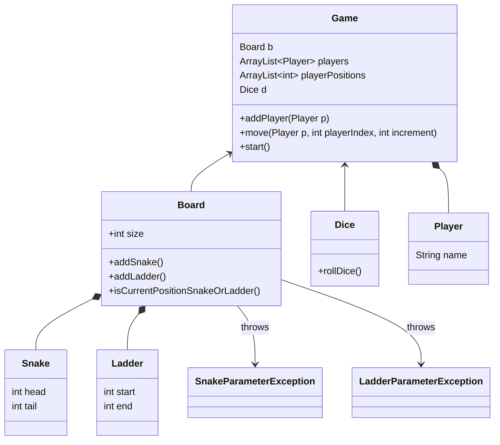

# Snake & Ladder

[](https://cdn.shopify.com/s/files/1/0876/1176/files/i984_pimgpsh_fullsize_distr.png?v=1525140332)

## Class Diagram



## How to run
- Create the instance of Game class
```java
Game g = new Game(new Board(100));
```

- Add Players
```java
g.addPlayer(new Player("Arjun"));
g.addPlayer(new Player("Bheem"));
```

- Start the game by calling start method
```java
g.start()
```
